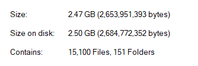
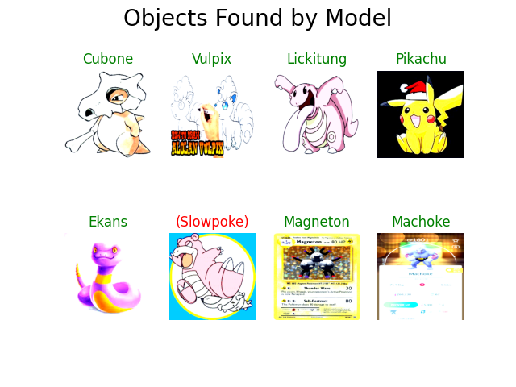

# FIND WHO'S THAT POKEMON WITH PYTORCH
#### All 151 classes of pokemon Generation 1 classification with torch-vision model.  

### ***Update [13/04/2023](gui_predict.py): Add gui_predict for easy predicting!*


## Demo:
This is the result that my model predicted, you can run ```predict_single.py``` to try it yourself.
  


## Requirements:
`CUDA`, `Conda` installed.  

```
pip install bing_image_downloader  
pip install tensorflow
pip install matplotlib
conda create --name torch-cuda
conda activate torch-cuda
conda install pytorch torchvision torchaudio pytorch-cuda=11.7 -c pytorch -c nvidia
```

## Dataset:
I used my custom dataset, it might take a long time so I wrote a `simp.py` tool to crawl data from the website.  
Here is my dataset after augmentations: [KAGGLE: Pokemon gen1 images classification dataset](https://www.kaggle.com/datasets/hongdcs/pokemon-gen1-151-classes-classification).  



## Data Preprocessing:  
##### First, `make.py` made folders.  
##### After crawling data from the website, I checked it and used `convert.py` to change all the images to png format.  
##### The dataset was not balanced, so I wrote `gen.py` for augmentation to make sure every class has 100 images.
##### Data was transformed over `transform.py` and was read in `preprocess.py`.

## Training:  
I used [resnet18](https://pytorch.org/vision/main/_modules/torchvision/models/resnet.html#resnet18) model from `torchvision.models` for training on [KAGGLE](https://www.kaggle.com/).  
I have upgraded an [EfficientNetV2](https://pytorch.org/vision/main/models/efficientnetv2.html#model-builders) version.  
#### The best accuracy of resnet18 model is about 68,8%.  
#### The best accuracy of efficientnetv2 model is about 69,3%. 

## Predicting:
#### `predict.py` to predict val_data.  

#### `predict_single.py` to predict single image from /predict.  
  
    
      

<h1 align="center"> 
  Thank you for stopping by! <height="60"> 
</h1>
